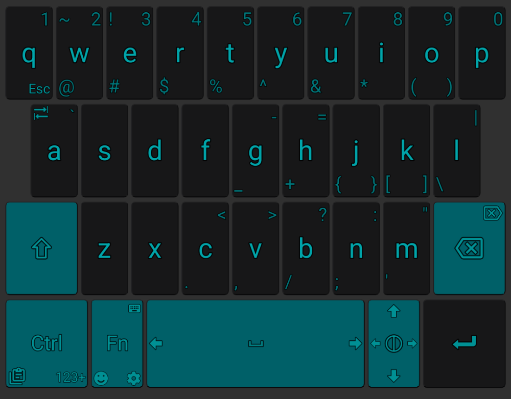
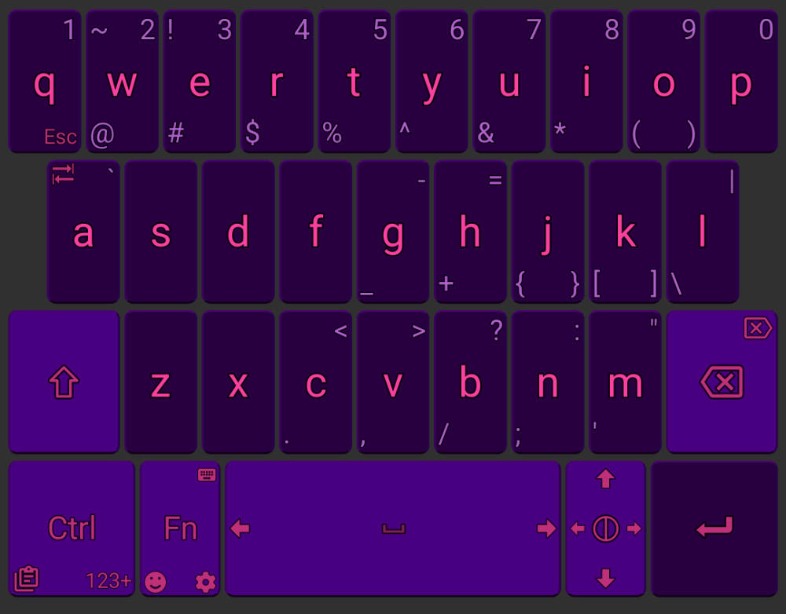
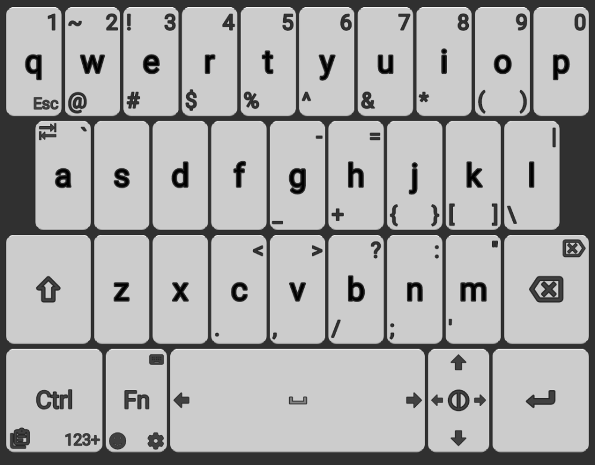

<p align="center">
  
</p>

<h1 align="center">Overboard</h1>

<p align="center">
  <strong>Transparent overlay keyboard for small-screen Android devices</strong><br/>
  Your apps never resize. Your content stays visible. Your keyboard floats on top.
</p>

---

Overboard renders as a system overlay instead of a standard input method window. Apps don't resize or shift when the keyboard appears — it just layers on top. Designed for phones with square or unusual aspect ratios (like the Unihertz MindOne), but works on any Android device.

## Features

### Overlay Mode
- **Floats over your app** without resizing it — zero layout shift
- **Adjustable transparency** — see your content through the keyboard
- **Text outlines & shadow halos** — labels stay readable over any background
- **Idle fade-out** — keyboard fades after a configurable timeout, snaps back on touch
- **Peek mode** — long-press spacebar to toggle keyboard visibility

### Interaction
- **Collapse button** — tap to dismiss, drag to reposition the keyboard vertically
- **Left/right handedness** — controls which side the collapse button sits on
- **Selection-aware** — keyboard fades or hides when you're selecting text
- **Smart delayed show** — avoids covering long-press menus and selection handles
- **Swipe typing** — slide keys toward corners for extra characters (inherited from Unexpected Keyboard)

### Themes

Overboard ships with keycap-inspired themes modeled after real mechanical keyboard keycap sets, plus standard light/dark options.

#### PBTfans X-Ray *(default)*
Translucent ice-blue keys with injection-molded dimple texture. Inspired by [PBTfans X-Ray](https://kbdfans.com/collections/pbtfans) by KBDfans.


#### MiTo Pulse
Dark alphas with rich teal modifier keys and turquoise legends. Inspired by [SA/GMK Pulse](https://drop.com/buy/massdrop-x-mito-sa-pulse-tkl-keycap-set) by [MiTo](https://mitormk.com/).



#### Matt3o /dev/tty
Warm beige alphas with warm gray modifiers and red accent keys. Inspired by [MT3 /dev/tty](https://drop.com/buy/drop-matt3o-mt3-dev-tty-keycap-set) by Matt3o.


#### MiTo MT3 Cyber
Deep purple keys with searing pink legends and neon accents. Inspired by [MT3 Cyber](https://drop.com/buy/drop-mito-mt3-cyber-custom-keycap-set) by [MiTo](https://mitormk.com/).



#### Tai-Hao Miami
Teal alpha keys with pink legends, pink modifier keys with teal legends. Inspired by [Tai-Hao Miami](https://shop.tai-hao.com/products/pbt--backlit--c22bu201) by Tai-Hao.


#### Dark / Light

| Dark | Light |
|------|-------|
|  |  |

> Theme screenshots are auto-generated with [Paparazzi](https://github.com/cashapp/paparazzi). Run `./gradlew recordPaparazziDebug` to regenerate.

### Privacy
- No ads
- No network requests
- No telemetry
- Fully open source (GPL-3.0)

---

## Built on Unexpected Keyboard

Overboard is a fork of [**Unexpected Keyboard**](https://github.com/Julow/Unexpected-Keyboard) by [Music Josun (Julow)](https://github.com/Julow) and its many contributors.

Unexpected Keyboard is an excellent, privacy-respecting Android keyboard with a brilliant swipe-to-corner input method. It was originally designed for programmers using Termux and has grown into a fantastic everyday keyboard. Overboard would not exist without their work.

**If you're on a standard phone and don't need overlay mode, go use [Unexpected Keyboard](https://github.com/Julow/Unexpected-Keyboard) directly. It's great.**

Thank you to the entire Unexpected Keyboard community for building such a solid, well-architected project and releasing it under a free license.

---

## Building

```sh
./gradlew assembleDebug
```

See [Contributing](CONTRIBUTING.md) for detailed build instructions.

## License

GPL-3.0 — See [LICENSE](LICENSE) for details.
